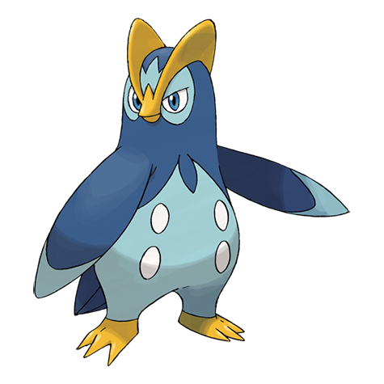

# Prinplup (#0394)

*Penguin Pokemon*

**Type:** Acqua
**Abilities:** [[Torrent]], [[Defiant]] *(Hidden)*
**Base HP:** 4

> Prinplups hunt in icy seas. They live solitary lives because they cannot stand company and will never form a group or a team. They believe they are the most important thing in the world, it’s almost irritating.

---

## Statistiche (Attributes & Limits)

| Attribute | Base / Limit |
|---|---|
| **Strength** | 2/4 |
| **Dexterity** | 2/4 |
| **Vitality** | 2/4 |
| **Special** | 2/5 |
| **Insight** | 2/5 |

---

## Mosse (Learnset)

- **Starter:** [[Growl|Growl]], [[Tackle|Tackle]]
- **Beginner:** [[Bubble|Bubble]], [[Water_Sport|Water Sport]]
- **Amateur:** [[Peck|Peck]], [[Metal_Claw|Metal Claw]], [[Bubble_Beam|Bubble Beam]], [[Bide|Bide]], [[Fury_Attack|Fury Attack]], [[Brine|Brine]], [[Whirlpool|Whirlpool]]
- **Ace:** [[Mist|Mist]], [[Drill_Peck|Drill Peck]], [[Hydro_Pump|Hydro Pump]]
- **Pro:** [[Agility|Agility]], [[Feather_Dance|Feather Dance]], [[Water_Pledge|Water Pledge]]

---

## Correlati

### Catena Evolutiva
- [[0393_Piplup|Piplup]]
- [[0394_Prinplup|Prinplup]]
- [[0395_Empoleon|Empoleon]]
