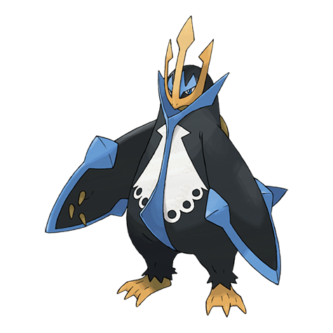

# Empoleon (#0395)

*Emperor Pokemon*

**Type:** Acqua / Acciaio
**Abilities:** [[Torrent]], [[Defiant]] *(Hidden)*
**Base HP:** 5

> They are regal and arrogant. Their beaks slice apart the drifting ice while swimming as fast as a jet boat. They avoid unnecessary fights, but will crush and cleave anyone that hurts or threatens its pride.

---

## Statistiche (Attributes & Limits)

| Attribute | Base / Limit |
|---|---|
| **Strength** | 2/5 |
| **Dexterity** | 2/4 |
| **Vitality** | 2/5 |
| **Special** | 3/6 |
| **Insight** | 3/6 |

---

## Mosse (Learnset)

- **Starter:** [[Tackle|Tackle]], [[Growl|Growl]]
- **Beginner:** [[Bubble|Bubble]], [[Swords_Dance|Swords Dance]]
- **Amateur:** [[Peck|Peck]], [[Metal_Claw|Metal Claw]], [[Bubble_Beam|Bubble Beam]], [[Swagger|Swagger]], [[Fury_Attack|Fury Attack]], [[Brine|Brine]], [[Aqua_Jet|Aqua Jet]], [[Whirlpool|Whirlpool]]
- **Ace:** [[Mist|Mist]], [[Drill_Peck|Drill Peck]], [[Hydro_Pump|Hydro Pump]]
- **Pro:** [[Iron_Defense|Iron Defense]], [[Aqua_Ring|Aqua Ring]], [[Hydro_Cannon|Hydro Cannon]]

---

## Correlati

### Catena Evolutiva
- [[0393_Piplup|Piplup]]
- [[0394_Prinplup|Prinplup]]
- [[0395_Empoleon|Empoleon]]
