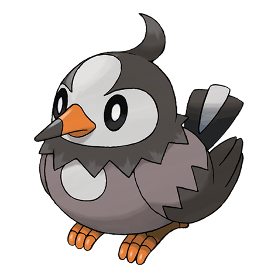

# Starly (#0396)

*Starling Pokemon*

**Type:** Normale / Volante
**Abilities:** [[Keen Eye]], [[Reckless]] *(Hidden)*
**Base HP:** 3

> They flock in dozens because they are very weak on their own. They live around mountains and fields, chasing Bug Pokemon. Everyone hates their annoying and strident singing.

---

## Statistiche (Attributes & Limits)

| Attribute | Base / Limit |
|---|---|
| **Strength** | 2/4 |
| **Dexterity** | 2/4 |
| **Vitality** | 1/3 |
| **Special** | 1/3 |
| **Insight** | 1/3 |

---

## Mosse (Learnset)

- **Starter:** [[Growl|Growl]], [[Tackle|Tackle]]
- **Beginner:** [[Quick_Attack|Quick Attack]], [[Wing_Attack|Wing Attack]]
- **Amateur:** [[Double_Team|Double Team]], [[Endeavor|Endeavor]], [[Whirlwind|Whirlwind]], [[Aerial_Ace|Aerial Ace]], [[Take_Down|Take Down]]
- **Ace:** [[Agility|Agility]], [[Brave_Bird|Brave Bird]], [[Final_Gambit|Final Gambit]]
- **Pro:** [[Astonish|Astonish]], [[Work_Up|Work Up]], [[Uproar|Uproar]]

---

## Correlati

### Catena Evolutiva
- [[0396_Starly|Starly]]
- [[0397_Staravia|Staravia]]
- [[0398_Staraptor|Staraptor]]
