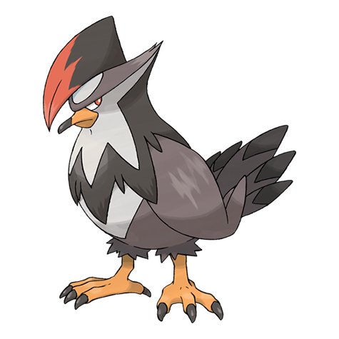

# Staraptor (#0398)

*Predator Pokemon*

**Type:** Normale / Volante
**Abilities:** [[Intimidate]], [[Reckless]] *(Hidden)*
**Base HP:** 5

> Staraptor is a savage creature. They will never stop attacking even if they get injured,and will fight foes bigger than themselves. They are known to leave their flock to live on their own when they evolve.

---

## Statistiche (Attributes & Limits)

| Attribute | Base / Limit |
|---|---|
| **Strength** | 3/7 |
| **Dexterity** | 3/6 |
| **Vitality** | 2/5 |
| **Special** | 2/4 |
| **Insight** | 2/4 |

---

## Mosse (Learnset)

- **Starter:** [[Growl|Growl]], [[Tackle|Tackle]]
- **Beginner:** [[Quick_Attack|Quick Attack]], [[Wing_Attack|Wing Attack]]
- **Amateur:** [[Double_Team|Double Team]], [[Endeavor|Endeavor]], [[Whirlwind|Whirlwind]], [[Aerial_Ace|Aerial Ace]], [[Take_Down|Take Down]]
- **Ace:** [[Close_Combat|Close Combat]], [[Agility|Agility]], [[Brave_Bird|Brave Bird]], [[Final_Gambit|Final Gambit]]
- **Pro:** [[Twister|Twister]], [[Roost|Roost]], [[Steel_Wing|Steel Wing]]

---

## Correlati

### Catena Evolutiva
- [[0396_Starly|Starly]]
- [[0397_Staravia|Staravia]]
- [[0398_Staraptor|Staraptor]]
