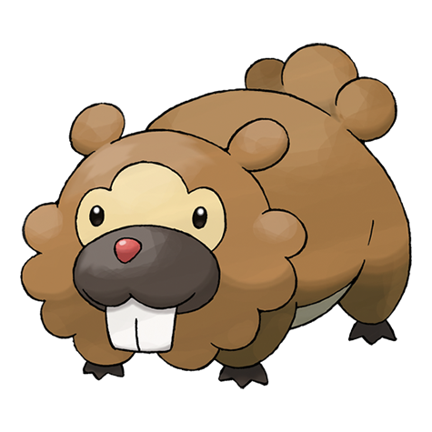

# Bidoof (#0399)

*Plump Mouse Pokemon*

**Type:** Normale
**Abilities:** [[Simple]], [[Unaware]], [[Moody]] *(Hidden)*
**Base HP:** 3

> Steady as a mountain, Bidoof has nerves of steel so nothing can disturb its focus. It is agile, active and a great team worker. They live in huge packs alongside rivers; the dams they build are incredibly sturdy.

---

## Statistiche (Attributes & Limits)

| Attribute | Base / Limit |
|---|---|
| **Strength** | 2/4 |
| **Dexterity** | 1/3 |
| **Vitality** | 1/3 |
| **Special** | 1/3 |
| **Insight** | 1/3 |

---

## Mosse (Learnset)

- **Starter:** [[Tackle|Tackle]]
- **Beginner:** [[Growl|Growl]], [[Defense_Curl|Defense Curl]], [[Take_Down|Take Down]]
- **Amateur:** [[Headbutt|Headbutt]], [[Hyper_Fang|Hyper Fang]], [[Yawn|Yawn]], [[Crunch|Crunch]], [[Amnesia|Amnesia]], [[Rollout|Rollout]]
- **Ace:** [[Swords_Dance|Swords Dance]], [[Super_Fang|Super Fang]], [[Superpower|Superpower]], [[Curse|Curse]]
- **Pro:** [[Water_Sport|Water Sport]], [[Mud_Slap|Mud Slap]], [[Last_Resort|Last Resort]]

---

## Correlati

### Catena Evolutiva
- [[0399_Bidoof|Bidoof]]
- [[0400_Bibarel|Bibarel]]
