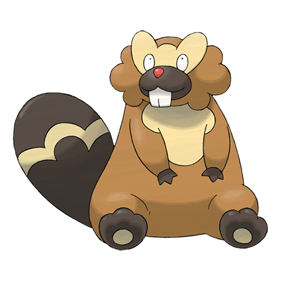

# Bibarel (#0400)

*Beaver Pokemon*

**Type:** Normale / Acqua
**Abilities:** [[Simple]], [[Unaware]], [[Moody]] *(Hidden)*
**Base HP:** 4

> Bibarels build dam streams with bark and mud. It is known as an industrious worker. Their constructions are very appreciated by people because a river dammed by Bibarel will never overflow.

---

## Statistiche (Attributes & Limits)

| Attribute | Base / Limit |
|---|---|
| **Strength** | 2/5 |
| **Dexterity** | 2/5 |
| **Vitality** | 2/4 |
| **Special** | 2/4 |
| **Insight** | 2/4 |

---

## Mosse (Learnset)

- **Starter:** [[Tackle|Tackle]]
- **Beginner:** [[Take_Down|Take Down]], [[Growl|Growl]], [[Defense_Curl|Defense Curl]]
- **Amateur:** [[Rollout|Rollout]], [[Water_Gun|Water Gun]], [[Headbutt|Headbutt]], [[Hyper_Fang|Hyper Fang]], [[Yawn|Yawn]], [[Crunch|Crunch]], [[Amnesia|Amnesia]], [[Rototiller|Rototiller]]
- **Ace:** [[Swords_Dance|Swords Dance]], [[Super_Fang|Super Fang]], [[Superpower|Superpower]], [[Curse|Curse]]
- **Pro:** [[Aqua_Tail|Aqua Tail]], [[Stealth_Rock|Stealth Rock]], [[Focus_Punch|Focus Punch]]

---

## Correlati

### Catena Evolutiva
- [[0399_Bidoof|Bidoof]]
- [[0400_Bibarel|Bibarel]]
