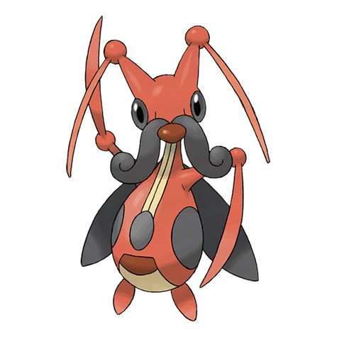

# Kricketune (#0402)

*Cricket Pokemon*

**Type:** Insetto
**Abilities:** [[Swarm]], [[Technician]] *(Hidden)*
**Base HP:** 4

> It can make all kind of sounds with its antennae, arms and mouth. It signals emotions with different tunes but scientists still cannot define what they mean. They imitate the songs they hear.

---

## Statistiche (Attributes & Limits)

| Attribute | Base / Limit |
|---|---|
| **Strength** | 2/5 |
| **Dexterity** | 2/4 |
| **Vitality** | 2/4 |
| **Special** | 2/4 |
| **Insight** | 2/4 |

---

## Mosse (Learnset)

- **Starter:** [[Growl|Growl]], [[Bide|Bide]]
- **Beginner:** [[Fury_Cutter|Fury Cutter]]
- **Amateur:** [[Absorb|Absorb]], [[Sing|Sing]], [[Focus_Energy|Focus Energy]], [[Slash|Slash]], [[X_Scissor|X-Scissor]], [[Screech|Screech]], [[Fell_Stinger|Fell Stinger]], [[Taunt|Taunt]]
- **Ace:** [[Night_Slash|Night Slash]], [[Sticky_Web|Sticky Web]], [[Bug_Buzz|Bug Buzz]], [[Perish_Song|Perish Song]]
- **Pro:** [[Hyper_Voice|Hyper Voice]], [[Silver_Wind|Silver Wind]], [[Mud_Slap|Mud Slap]]

---

## Correlati

### Catena Evolutiva
- [[0401_Kricketot|Kricketot]]
- [[0402_Kricketune|Kricketune]]
