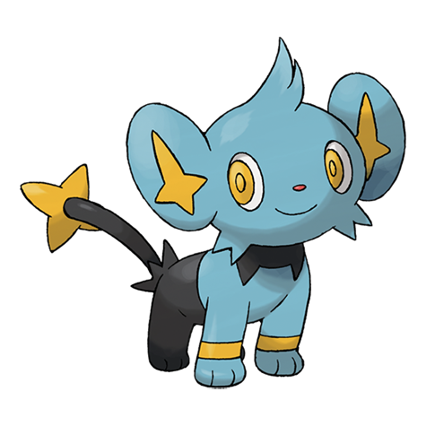

# Shinx (#0403)

*Flash Pokemon*

**Type:** Elettro
**Abilities:** [[Rivalry]], [[Intimidate]], [[Guts]] *(Hidden)*
**Base HP:** 3

> Its body transforms the energy of its own muscles into electricity. When in danger, their whole fur shines in a flash to blind the foes. They live with their parents and siblings in small prides.

---

## Statistiche (Attributes & Limits)

| Attribute | Base / Limit |
|---|---|
| **Strength** | 2/4 |
| **Dexterity** | 2/4 |
| **Vitality** | 1/3 |
| **Special** | 1/3 |
| **Insight** | 1/3 |

---

## Mosse (Learnset)

- **Starter:** [[Tackle|Tackle]], [[Leer|Leer]]
- **Beginner:** [[Charge|Charge]], [[Baby_Doll_Eyes|Baby-Doll Eyes]]
- **Amateur:** [[Spark|Spark]], [[Bite|Bite]], [[Roar|Roar]], [[Swagger|Swagger]], [[Thunder_Fang|Thunder Fang]]
- **Ace:** [[Crunch|Crunch]], [[Scary_Face|Scary Face]], [[Discharge|Discharge]], [[Wild_Charge|Wild Charge]]
- **Pro:** [[Fake_Tears|Fake Tears]], [[Ice_Fang|Ice Fang]], [[Fire_Fang|Fire Fang]]

---

## Correlati

### Catena Evolutiva
- [[0403_Shinx|Shinx]]
- [[0404_Luxio|Luxio]]
- [[0405_Luxray|Luxray]]
