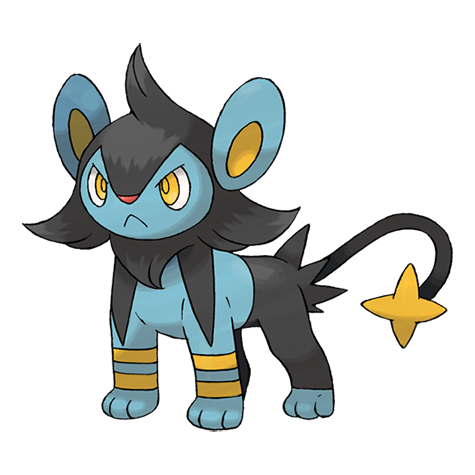

# Luxio (#0404)

*Spark Pokemon*

**Type:** Elettro
**Abilities:** [[Rivalry]], [[Intimidate]], [[Guts]] *(Hidden)*
**Base HP:** 4

> Female Luxios stay with the pride but males roam in marauding groups, trying to become strong enough to make their own pride. Its claws and teeth are charged with electricity, approach with caution.

---

## Statistiche (Attributes & Limits)

| Attribute | Base / Limit |
|---|---|
| **Strength** | 2/5 |
| **Dexterity** | 2/4 |
| **Vitality** | 2/4 |
| **Special** | 2/4 |
| **Insight** | 2/4 |

---

## Mosse (Learnset)

- **Starter:** [[Tackle|Tackle]], [[Leer|Leer]]
- **Beginner:** [[Charge|Charge]], [[Baby_Doll_Eyes|Baby-Doll Eyes]]
- **Amateur:** [[Spark|Spark]], [[Bite|Bite]], [[Roar|Roar]], [[Swagger|Swagger]], [[Thunder_Fang|Thunder Fang]]
- **Ace:** [[Crunch|Crunch]], [[Scary_Face|Scary Face]], [[Discharge|Discharge]], [[Wild_Charge|Wild Charge]]
- **Pro:** [[Howl|Howl]], [[Ice_Fang|Ice Fang]], [[Fire_Fang|Fire Fang]]

---

## Correlati

### Catena Evolutiva
- [[0403_Shinx|Shinx]]
- [[0404_Luxio|Luxio]]
- [[0405_Luxray|Luxray]]
