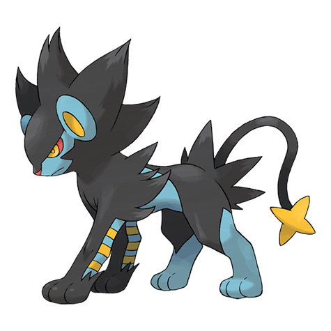

# Luxray (#0405)

*Gleam Eyes Pokemon*

**Type:** Elettro
**Abilities:** [[Rivalry]], [[Intimidate]], [[Guts]] *(Hidden)*
**Base HP:** 5

> It is said that it can see through walls. This Pokemon can easily find hiding prey and locate its young. Male Luxrays can be found roaming alone, patrolling their territory; the females hunt in groups.

---

## Statistiche (Attributes & Limits)

| Attribute | Base / Limit |
|---|---|
| **Strength** | 3/7 |
| **Dexterity** | 2/5 |
| **Vitality** | 2/5 |
| **Special** | 3/6 |
| **Insight** | 2/5 |

---

## Mosse (Learnset)

- **Starter:** [[Leer|Leer]], [[Tackle|Tackle]]
- **Beginner:** [[Electric_Terrain|Electric Terrain]], [[Charge|Charge]]
- **Amateur:** [[Spark|Spark]], [[Bite|Bite]], [[Roar|Roar]], [[Swagger|Swagger]], [[Thunder_Fang|Thunder Fang]]
- **Ace:** [[Crunch|Crunch]], [[Scary_Face|Scary Face]], [[Discharge|Discharge]], [[Wild_Charge|Wild Charge]]
- **Pro:** [[Magnet_Rise|Magnet Rise]], [[Night_Slash|Night Slash]], [[Superpower|Superpower]]

---

## Correlati

### Catena Evolutiva
- [[0403_Shinx|Shinx]]
- [[0404_Luxio|Luxio]]
- [[0405_Luxray|Luxray]]
