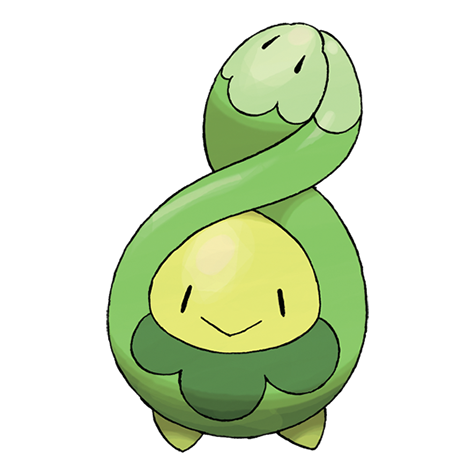

# Budew (#0406)

*Bud Pokemon*

**Type:** Erba / Veleno
**Abilities:** [[Natural Cure]], [[Poison Point]], [[Leaf Guard]] *(Hidden)*
**Base HP:** 3

> It blossoms near clear ponds. Budew needs nurturing and care to grow healthy and beautiful, otherwise its bud will never bloom. If threatened, they will reveal their small but poisonous thorns.

---

## Statistiche (Attributes & Limits)

| Attribute | Base / Limit |
|---|---|
| **Strength** | 1/3 |
| **Dexterity** | 2/4 |
| **Vitality** | 1/3 |
| **Special** | 2/4 |
| **Insight** | 2/5 |

---

## Mosse (Learnset)

- **Starter:** [[Absorb|Absorb]]
- **Beginner:** [[Growth|Growth]], [[Water_Sport|Water Sport]], [[Stun_Spore|Stun Spore]]
- **Amateur:** [[Mega_Drain|Mega Drain]], [[Worry_Seed|Worry Seed]]
- **Pro:** [[Spikes|Spikes]], [[Extrasensory|Extrasensory]], [[Endure|Endure]]

---

## Correlati

### Catena Evolutiva
- [[0406_Budew|Budew]]
- [[0315_Roselia|Roselia]]
