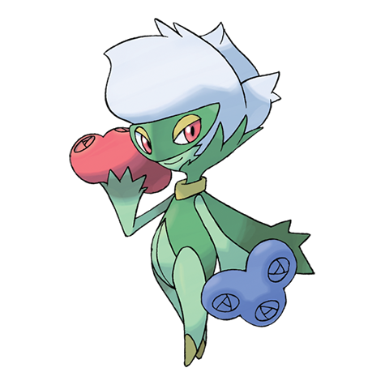

# Roserade (#0407)

*Bouquet Pokemon*

**Type:** Erba / Veleno
**Abilities:** [[Natural Cure]], [[Poison Point]], [[Technician]] *(Hidden)*
**Base HP:** 5

> Luring prey with a sweet scent, it uses the poison on its thorn-filled arm-whips to poison, bind and finish off the prey. It has a dangerous appeal mixed with a graceful personality. It’s very rare in the wild.

---

## Statistiche (Attributes & Limits)

| Attribute | Base / Limit |
|---|---|
| **Strength** | 2/5 |
| **Dexterity** | 2/5 |
| **Vitality** | 2/4 |
| **Special** | 3/7 |
| **Insight** | 3/6 |

---

## Mosse (Learnset)

- **Beginner:** [[Poison_Sting|Poison Sting]], [[Grassy_Terrain|Grassy Terrain]]
- **Amateur:** [[Weather_Ball|Weather Ball]], [[Venom_Drench|Venom Drench]], [[Mega_Drain|Mega Drain]], [[Magical_Leaf|Magical Leaf]], [[Sweet_Scent|Sweet Scent]]
- **Pro:** [[Extrasensory|Extrasensory]], [[Leaf_Storm|Leaf Storm]], [[Pin_Missile|Pin Missile]]

---

