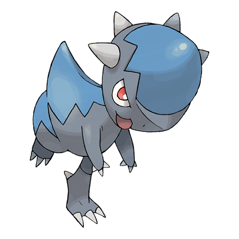

# Cranidos (#0408)

*Head Butt Pokemon*

**Type:** Roccia
**Abilities:** [[Mold Breaker]], [[Sheer Force]] *(Hidden)*
**Base HP:** 3

> It was resurrected from an iron ball-like fossil. It downs prey with headbutts and tramples trees and walls with ease. They were plentiful 100 million years ago. You can’t find one nowadays except as a fossil.

---

## Statistiche (Attributes & Limits)

| Attribute | Base / Limit |
|---|---|
| **Strength** | 3/7 |
| **Dexterity** | 2/4 |
| **Vitality** | 1/3 |
| **Special** | 1/3 |
| **Insight** | 1/3 |

---

## Mosse (Learnset)

- **Starter:** [[Focus_Energy|Focus Energy]], [[Leer|Leer]]
- **Beginner:** [[Take_Down|Take Down]], [[Pursuit|Pursuit]]
- **Amateur:** [[Headbutt|Headbutt]], [[Scary_Face|Scary Face]], [[Assurance|Assurance]], [[Chip_Away|Chip Away]], [[Ancient_Power|Ancient Power]]
- **Ace:** [[Zen_Headbutt|Zen Headbutt]], [[Screech|Screech]], [[Head_Smash|Head Smash]]
- **Pro:** [[Superpower|Superpower]], [[Iron_Head|Iron Head]], [[Hammer_Arm|Hammer Arm]]

---

## Correlati

### Catena Evolutiva
- [[0408_Cranidos|Cranidos]]
- [[0409_Rampardos|Rampardos]]
