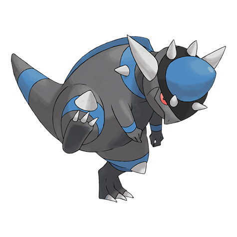

# Rampardos (#0409)

*Head Butt Pokemon*

**Type:** Roccia
**Abilities:** [[Mold Breaker]], [[Sheer Force]] *(Hidden)*
**Base HP:** 4

> Its skull withstands any magnitude of impact. As a result, its brain never gets the chance to grow, this may have been the cause of its extinction. It is capable of rolling a truck over with a single strike.

---

## Statistiche (Attributes & Limits)

| Attribute | Base / Limit |
|---|---|
| **Strength** | 4/8 |
| **Dexterity** | 2/4 |
| **Vitality** | 2/4 |
| **Special** | 2/4 |
| **Insight** | 2/4 |

---

## Mosse (Learnset)

- **Starter:** [[Focus_Energy|Focus Energy]], [[Leer|Leer]]
- **Beginner:** [[Take_Down|Take Down]], [[Pursuit|Pursuit]]
- **Amateur:** [[Headbutt|Headbutt]], [[Scary_Face|Scary Face]], [[Assurance|Assurance]], [[Chip_Away|Chip Away]], [[Endeavor|Endeavor]], [[Ancient_Power|Ancient Power]]
- **Ace:** [[Zen_Headbutt|Zen Headbutt]], [[Screech|Screech]], [[Head_Smash|Head Smash]]
- **Pro:** [[Superpower|Superpower]], [[Iron_Head|Iron Head]], [[Outrage|Outrage]]

---

## Correlati

### Catena Evolutiva
- [[0408_Cranidos|Cranidos]]
- [[0409_Rampardos|Rampardos]]
