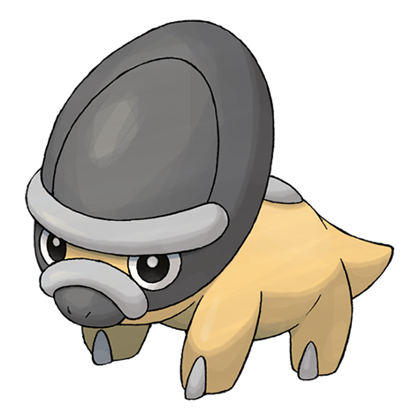

# Shieldon (#0410)

*Shield Pokemon*

**Type:** Roccia / Acciaio
**Abilities:** [[Sturdy]], [[Soundproof]] *(Hidden)*
**Base HP:** 3

> It was cloned from a fossil dug out from a layer of clay. It is outstandingly armored. As a result, it can eat grass and berries without having to fight many Pokemon who would dare to prey on it.

---

## Statistiche (Attributes & Limits)

| Attribute | Base / Limit |
|---|---|
| **Strength** | 1/3 |
| **Dexterity** | 1/3 |
| **Vitality** | 3/6 |
| **Special** | 1/3 |
| **Insight** | 2/5 |

---

## Mosse (Learnset)

- **Starter:** [[Tackle|Tackle]], [[Protect|Protect]]
- **Beginner:** [[Taunt|Taunt]], [[Metal_Sound|Metal Sound]]
- **Amateur:** [[Take_Down|Take Down]], [[Iron_Defense|Iron Defense]], [[Swagger|Swagger]], [[Ancient_Power|Ancient Power]], [[Endure|Endure]]
- **Ace:** [[Metal_Burst|Metal Burst]], [[Iron_Head|Iron Head]], [[Heavy_Slam|Heavy Slam]]
- **Pro:** [[Guard_Split|Guard Split]], [[Wide_Guard|Wide Guard]], [[Counter|Counter]]

---

## Correlati

### Catena Evolutiva
- [[0410_Shieldon|Shieldon]]
- [[0411_Bastiodon|Bastiodon]]
