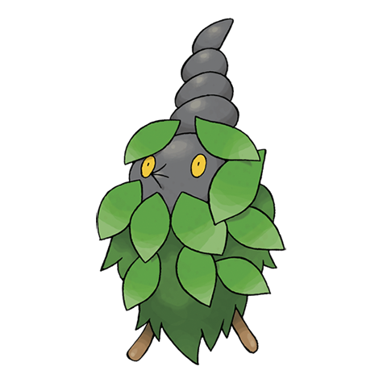

# Burmy (#0412)

*Bagworm Pokemon*

**Type:** Insetto
**Abilities:** [[Shed Skin]], [[Overcoat]] *(Hidden)*
**Base HP:** 3

> This Pokemon has adapted to live in the forests, deserts and in the city. It makes a cloak with the materials close to it to protect itself from the weather. Males evolve into a Mothim and females into a Wormadam.

---

## Statistiche (Attributes & Limits)

| Attribute | Base / Limit |
|---|---|
| **Strength** | 1/3 |
| **Dexterity** | 1/3 |
| **Vitality** | 2/4 |
| **Special** | 1/3 |
| **Insight** | 2/4 |

---

## Mosse (Learnset)

- **Starter:** [[Protect|Protect]]
- **Beginner:** [[Tackle|Tackle]]
- **Amateur:** [[Bug_Bite|Bug Bite]], [[Hidden_Power|Hidden Power]]
- **Pro:** [[Electroweb|Electroweb]], [[String_Shot|String Shot]]

---

## Correlati

### Catena Evolutiva
- [[0412_Burmy|Burmy]]
- Wormadam (Grass Form)
- Wormadam (Steel Form)
- Wormadam (Ground Form)
- [[0414_Mothim|Mothim]]
