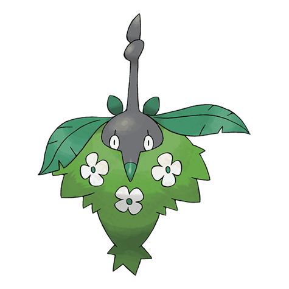

# Wormadam (#0413)

*Bagworm Pokemon*

**Type:** Insetto / Erba
**Abilities:** [[Anticipation]], [[Overcoat]] *(Hidden)*
**Base HP:** 4

> When Burmy evolved, its Grass cloak became a part of its body. For this reason there are many variations in body and type. It is a calm Pokemon that loves flowers. This Pokemon is female only.

---

## Statistiche (Attributes & Limits)

| Attribute | Base / Limit |
|---|---|
| **Strength** | 2/4 |
| **Dexterity** | 1/3 |
| **Vitality** | 3/6 |
| **Special** | 2/5 |
| **Insight** | 2/5 |

---

## Mosse (Learnset)

- **Starter:** [[Protect|Protect]]
- **Beginner:** [[Tackle|Tackle]]
- **Amateur:** [[Captivate|Captivate]], [[Flail|Flail]], [[Bug_Bite|Bug Bite]], [[Hidden_Power|Hidden Power]], [[Confusion|Confusion]], [[Razor_Leaf|Razor Leaf]], [[Growth|Growth]], [[Psybeam|Psybeam]]
- **Ace:** [[Quiver_Dance|Quiver Dance]], [[Sucker_Punch|Sucker Punch]], [[Attract|Attract]], [[Psychic|Psychic]], [[Leaf_Storm|Leaf Storm]], [[Bug_Buzz|Bug Buzz]]
- **Pro:** [[Synthesis|Synthesis]], [[Electroweb|Electroweb]], [[Giga_Drain|Giga Drain]]

---

---

## Wormadam (Forma Terra) (#0413F2)

**Type:** Insetto / Terra
**Abilities:** [[Speed Boost]], [[Compound Eyes]], [[Overcoat]] *(Hidden)*
**Base HP:** 4

| Attribute | Base / Limit |
|---|---|
| **Strength** | 2/5 |
| **Dexterity** | 1/3 |
| **Vitality** | 3/6 |
| **Special** | 2/4 |
| **Insight** | 2/5 |

### Mosse

- **Starter:** [[Protect|Protect]]
- **Beginner:** [[Tackle|Tackle]]
- **Amateur:** [[Captivate|Captivate]], [[Flail|Flail]], [[Bug_Bite|Bug Bite]], [[Hidden_Power|Hidden Power]], [[Confusion|Confusion]], [[Rock_Blast|Rock Blast]], [[Harden|Harden]], [[Psybeam|Psybeam]]
- **Ace:** [[Quiver_Dance|Quiver Dance]], [[Sucker_Punch|Sucker Punch]], [[Attract|Attract]], [[Psychic|Psychic]], [[Fissure|Fissure]], [[Bug_Buzz|Bug Buzz]]
- **Pro:** [[Synthesis|Synthesis]], [[Electroweb|Electroweb]], [[Stealth_Rock|Stealth Rock]]

---

## Wormadam (Forma Acciaio) (#0413F1)

**Type:** Insetto / Acciaio
**Abilities:** [[Speed Boost]], [[Compound Eyes]], [[Overcoat]] *(Hidden)*
**Base HP:** 4

| Attribute | Base / Limit |
|---|---|
| **Strength** | 2/4 |
| **Dexterity** | 1/3 |
| **Vitality** | 3/6 |
| **Special** | 2/4 |
| **Insight** | 2/6 |

### Mosse

- **Starter:** [[Protect|Protect]]
- **Beginner:** [[Tackle|Tackle]]
- **Amateur:** [[Flail|Flail]], [[Captivate|Captivate]], [[Bug_Bite|Bug Bite]], [[Hidden_Power|Hidden Power]], [[Mirror_Shot|Mirror Shot]], [[Metal_Sound|Metal Sound]], [[Psybeam|Psybeam]]
- **Ace:** [[Sucker_Punch|Sucker Punch]], [[Quiver_Dance|Quiver Dance]], [[Attract|Attract]], [[Psychic|Psychic]], [[Iron_Head|Iron Head]], [[Bug_Buzz|Bug Buzz]]
- **Pro:** [[Electroweb|Electroweb]], [[Iron_Defense|Iron Defense]], [[Synthesis|Synthesis]]
