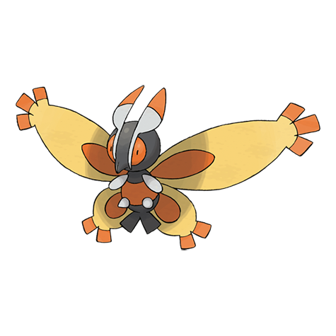

# Mothim (#0414)

*Moth Pokemon*

**Type:** Insetto / Volante
**Abilities:** [[Swarm]], [[Tinted Lens]] *(Hidden)*
**Base HP:** 4

> It flies near the mountains in search of honey. It is an opportunist and won’t gather any honey by itself, instead Mothim steals from Combee hives and other Pokemon. This Pokemon is male only.

---

## Statistiche (Attributes & Limits)

| Attribute | Base / Limit |
|---|---|
| **Strength** | 3/6 |
| **Dexterity** | 2/4 |
| **Vitality** | 2/4 |
| **Special** | 3/6 |
| **Insight** | 2/4 |

---

## Mosse (Learnset)

- **Starter:** [[Tackle|Tackle]]
- **Beginner:** [[Bug_Bite|Bug Bite]]
- **Amateur:** [[Hidden_Power|Hidden Power]], [[Confusion|Confusion]], [[Gust|Gust]], [[Poison_Powder|Poison Powder]], [[Psybeam|Psybeam]], [[Camouflage|Camouflage]], [[Silver_Wind|Silver Wind]], [[Air_Slash|Air Slash]]
- **Ace:** [[Psychic|Psychic]], [[Bug_Buzz|Bug Buzz]], [[Lunge|Lunge]], [[Quiver_Dance|Quiver Dance]]
- **Pro:** [[Electroweb|Electroweb]], [[Twister|Twister]], [[Giga_Drain|Giga Drain]]

---

## Correlati

### Catena Evolutiva
- [[0412_Burmy|Burmy]]
- Wormadam (Grass Form)
- Wormadam (Steel Form)
- Wormadam (Ground Form)
- [[0414_Mothim|Mothim]]
