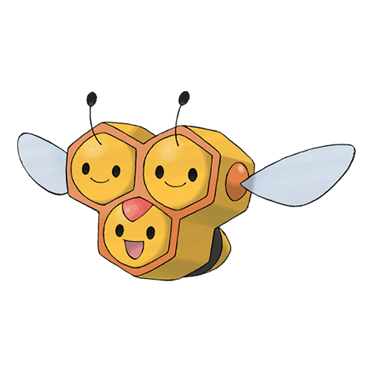

# Combee (#0415)

*Tiny Bee Pokemon*

**Type:** Insetto / Volante
**Abilities:** [[Honey Gather]], [[Hustle]] *(Hidden)*
**Base HP:** 3

> It forms hives around trees. It flies all day sipping the nectar from flowers to make honey. It is usually born a male. If a female is born, it will grow into a Vespiqueen and start its own Hive.

---

## Statistiche (Attributes & Limits)

| Attribute | Base / Limit |
|---|---|
| **Strength** | 1/3 |
| **Dexterity** | 2/5 |
| **Vitality** | 1/3 |
| **Special** | 1/3 |
| **Insight** | 1/3 |

---

## Mosse (Learnset)

- **Starter:** [[Sweet_Scent|Sweet Scent]], [[Gust|Gust]]
- **Amateur:** [[Bug_Bite|Bug Bite]], [[Bug_Buzz|Bug Buzz]]
- **Pro:** [[Tailwind|Tailwind]], [[Swift|Swift]], [[Endeavor|Endeavor]]

---

## Correlati

### Catena Evolutiva
- [[0415_Combee|Combee]]
- [[0416_Vespiquen|Vespiquen]]
