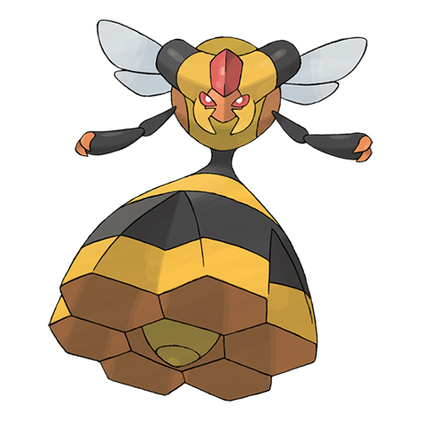

# Vespiquen (#0416)

*Beehive Pokemon*

**Type:** Insetto / Volante
**Abilities:** [[Pressure]], [[Unnerve]] *(Hidden)*
**Base HP:** 4

> This Pokemon is female only. It raises grubs in the holes in its body and secretes pheromones to control Combee to fight and gather honey for her. It is a royal Pokemon that won’t take orders from anyone.

---

## Statistiche (Attributes & Limits)

| Attribute | Base / Limit |
|---|---|
| **Strength** | 2/5 |
| **Dexterity** | 2/4 |
| **Vitality** | 3/6 |
| **Special** | 2/5 |
| **Insight** | 3/6 |

---

## Mosse (Learnset)

- **Starter:** [[Sweet_Scent|Sweet Scent]], [[Gust|Gust]]
- **Beginner:** [[Poison_Sting|Poison Sting]], [[Confuse_Ray|Confuse Ray]], [[Fury_Cutter|Fury Cutter]], [[Pursuit|Pursuit]]
- **Amateur:** [[Fell_Stinger|Fell Stinger]], [[Attack_Order|Attack Order]], [[Fury_Swipes|Fury Swipes]], [[Defend_Order|Defend Order]], [[Slash|Slash]], [[Power_Gem|Power Gem]], [[Heal_Order|Heal Order]], [[Toxic|Toxic]]
- **Ace:** [[Air_Slash|Air Slash]], [[Captivate|Captivate]], [[Destiny_Bond|Destiny Bond]], [[Swagger|Swagger]]
- **Pro:** [[Signal_Beam|Signal Beam]], [[Endure|Endure]], [[Ominous_Wind|Ominous Wind]]

---

## Correlati

### Catena Evolutiva
- [[0415_Combee|Combee]]
- [[0416_Vespiquen|Vespiquen]]
