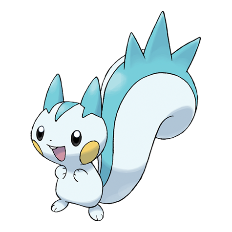

# Pachirisu (#0417)

*EleSquirrel Pokemon*

**Type:** Elettro
**Abilities:** [[Run Away]], [[Pickup]], [[Volt Absorb]] *(Hidden)*
**Base HP:** 4

> It lives on top of the trees, gathering food for the cold winter months. It keeps warm by making fur balls charged with static electricity. Like other electric rodents, it stores electricity on its cheek pouches.

---

## Statistiche (Attributes & Limits)

| Attribute | Base / Limit |
|---|---|
| **Strength** | 2/4 |
| **Dexterity** | 3/6 |
| **Vitality** | 2/5 |
| **Special** | 2/4 |
| **Insight** | 2/5 |

---

## Mosse (Learnset)

- **Starter:** [[Growl|Growl]], [[Bide|Bide]]
- **Beginner:** [[Quick_Attack|Quick Attack]], [[Charm|Charm]]
- **Amateur:** [[Spark|Spark]], [[Endure|Endure]], [[Nuzzle|Nuzzle]], [[Swift|Swift]], [[Electro_Ball|Electro Ball]], [[Sweet_Kiss|Sweet Kiss]], [[Thunder_Wave|Thunder Wave]]
- **Ace:** [[Super_Fang|Super Fang]], [[Discharge|Discharge]], [[Last_Resort|Last Resort]], [[Hyper_Fang|Hyper Fang]]
- **Pro:** [[Follow_Me|Follow Me]], [[Seed_Bomb|Seed Bomb]], [[Fake_Tears|Fake Tears]]

---

