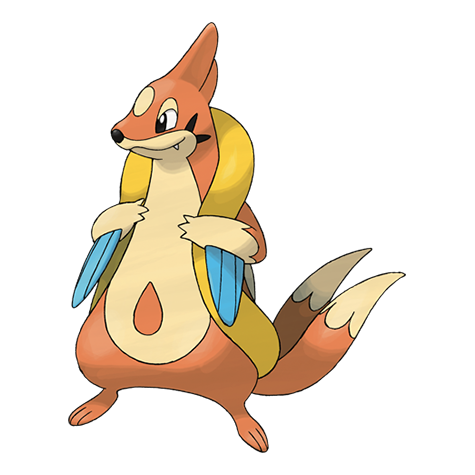

# Floatzel (#0419)

*Sea Weasel Pokemon*

**Type:** Acqua
**Abilities:** [[Swift Swim]], [[Water Veil]] *(Hidden)*
**Base HP:** 4

> It floats using its well-developed sack. They roam close to fishing spots to steal an easy meal. People allow them to hang around their boats because they help whenever a person falls into the water.

---

## Statistiche (Attributes & Limits)

| Attribute | Base / Limit |
|---|---|
| **Strength** | 3/6 |
| **Dexterity** | 3/6 |
| **Vitality** | 2/4 |
| **Special** | 2/5 |
| **Insight** | 2/4 |

---

## Mosse (Learnset)

- **Starter:** [[Sonic_Boom|Sonic Boom]], [[Growl|Growl]]
- **Beginner:** [[Water_Sport|Water Sport]], [[Quick_Attack|Quick Attack]], [[Ice_Fang|Ice Fang]]
- **Amateur:** [[Razor_Wind|Razor Wind]], [[Water_Gun|Water Gun]], [[Pursuit|Pursuit]], [[Swift|Swift]], [[Aqua_Jet|Aqua Jet]], [[Double_Hit|Double Hit]], [[Whirlpool|Whirlpool]]
- **Ace:** [[Crunch|Crunch]], [[Aqua_Tail|Aqua Tail]], [[Agility|Agility]], [[Hydro_Pump|Hydro Pump]]
- **Pro:** [[Ice_Punch|Ice Punch]], [[Iron_Tail|Iron Tail]], [[Aqua_Ring|Aqua Ring]]

---

## Correlati

### Catena Evolutiva
- [[0418_Buizel|Buizel]]
- [[0419_Floatzel|Floatzel]]
