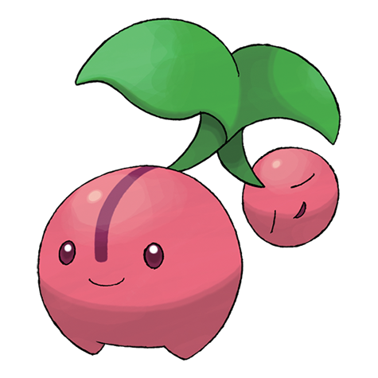

# Cherubi (#0420)

*Cherry Pokemon*

**Type:** Erba
**Abilities:** [[Chlorophyll]]
**Base HP:** 3

> It hides on bushes while absorbing the sunlight. Their small heads store the energy needed for evolution, but this small head is frequently eaten by other Pokemon and people so it’s hard for them to evolve.

---

## Statistiche (Attributes & Limits)

| Attribute | Base / Limit |
|---|---|
| **Strength** | 1/3 |
| **Dexterity** | 1/3 |
| **Vitality** | 2/4 |
| **Special** | 2/4 |
| **Insight** | 2/4 |

---

## Mosse (Learnset)

- **Starter:** [[Tackle|Tackle]]
- **Beginner:** [[Leech_Seed|Leech Seed]], [[Growth|Growth]]
- **Amateur:** [[Morning_Sun|Morning Sun]], [[Helping_Hand|Helping Hand]], [[Magical_Leaf|Magical Leaf]], [[Sunny_Day|Sunny Day]], [[Worry_Seed|Worry Seed]], [[Take_Down|Take Down]]
- **Ace:** [[Solar_Beam|Solar Beam]], [[Lucky_Chant|Lucky Chant]], [[Petal_Blizzard|Petal Blizzard]]
- **Pro:** [[Heal_Pulse|Heal Pulse]], [[Weather_Ball|Weather Ball]], [[Nature_Power|Nature Power]]

---

## Correlati

### Catena Evolutiva
- [[0420_Cherubi|Cherubi]]
- [[0421_Cherrim|Cherrim]]
