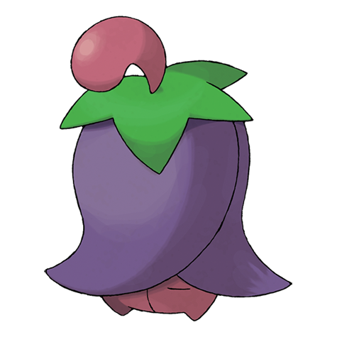

# Cherrim (#0421)

*Blossom Pokemon*

**Type:** Erba
**Abilities:** [[Flower Gift]]
**Base HP:** 4

> Cherrims bloom during times of strong sunlight, their petals open fully and radiant. If the sun is not visible, it will remain as a closed bud, barely moving trying to preserve its energy.

---

## Statistiche (Attributes & Limits)

| Attribute | Base / Limit |
|---|---|
| **Strength** | 2/4 |
| **Dexterity** | 2/5 |
| **Vitality** | 2/5 |
| **Special** | 2/5 |
| **Insight** | 2/5 |

---

## Mosse (Learnset)

- **Starter:** [[Tackle|Tackle]]
- **Beginner:** [[Leech_Seed|Leech Seed]], [[Growth|Growth]]
- **Amateur:** [[Morning_Sun|Morning Sun]], [[Helping_Hand|Helping Hand]], [[Magical_Leaf|Magical Leaf]], [[Sunny_Day|Sunny Day]], [[Petal_Dance|Petal Dance]], [[Worry_Seed|Worry Seed]], [[Take_Down|Take Down]]
- **Ace:** [[Solar_Beam|Solar Beam]], [[Lucky_Chant|Lucky Chant]], [[Petal_Blizzard|Petal Blizzard]]
- **Pro:** [[Aromatherapy|Aromatherapy]], [[Heal_Pulse|Heal Pulse]], [[Synthesis|Synthesis]]

---

## Correlati

### Catena Evolutiva
- [[0420_Cherubi|Cherubi]]
- [[0421_Cherrim|Cherrim]]
