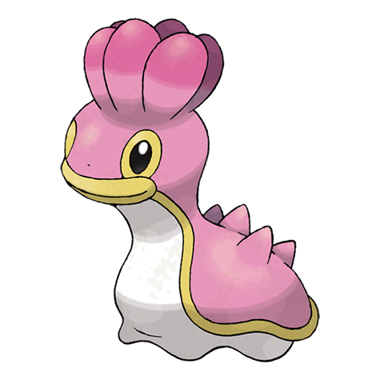

# Shellos (#0422)

*Sea Slug Pokemon*

**Type:** Acqua
**Abilities:** [[Sticky Hold]], [[Storm Drain]], [[Sand Force]] *(Hidden)*
**Base HP:** 3

> Its shape and coloration change depending on its habitat of salt or sweet water. Their body is very soft and squishy but they can stretch long lengths. It releases a purple liquid from its body if threatened.

---

## Statistiche (Attributes & Limits)

| Attribute | Base / Limit |
|---|---|
| **Strength** | 2/4 |
| **Dexterity** | 1/3 |
| **Vitality** | 2/4 |
| **Special** | 2/4 |
| **Insight** | 2/4 |

---

## Mosse (Learnset)

- **Starter:** [[Mud_Slap|Mud Slap]], [[Mud_Sport|Mud Sport]]
- **Beginner:** [[Harden|Harden]], [[Water_Pulse|Water Pulse]], [[Mud_Bomb|Mud Bomb]]
- **Amateur:** [[Hidden_Power|Hidden Power]], [[Rain_Dance|Rain Dance]], [[Body_Slam|Body Slam]], [[Muddy_Water|Muddy Water]]
- **Ace:** [[Recover|Recover]]
- **Pro:** [[Acid_Armor|Acid Armor]], [[Amnesia|Amnesia]], [[Earth_Power|Earth Power]]

---

## Correlati

### Catena Evolutiva
- [[0422_Shellos|Shellos]]
- [[0423_Gastrodon|Gastrodon]]
