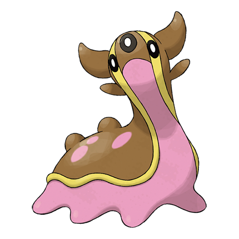

# Gastrodon (#0423)

*Sea Slug Pokemon*

**Type:** Acqua / Terra
**Abilities:** [[Sticky Hold]], [[Storm Drain]], [[Sand Force]] *(Hidden)*
**Base HP:** 6

> It has a pliable body without any bones. If any part of its body is torn off, it will grow back in minutes. There is evidence that it had a hard shell on its back for protection in prehistoric times.

---

## Statistiche (Attributes & Limits)

| Attribute | Base / Limit |
|---|---|
| **Strength** | 2/5 |
| **Dexterity** | 1/3 |
| **Vitality** | 2/4 |
| **Special** | 2/5 |
| **Insight** | 2/5 |

---

## Mosse (Learnset)

- **Starter:** [[Mud_Slap|Mud Slap]], [[Mud_Sport|Mud Sport]]
- **Beginner:** [[Harden|Harden]], [[Water_Pulse|Water Pulse]], [[Mud_Bomb|Mud Bomb]]
- **Amateur:** [[Hidden_Power|Hidden Power]], [[Rain_Dance|Rain Dance]], [[Body_Slam|Body Slam]], [[Muddy_Water|Muddy Water]], [[Recover|Recover]]
- **Pro:** [[Acid_Armor|Acid Armor]], [[Counter|Counter]], [[Fissure|Fissure]]

---

## Correlati

### Catena Evolutiva
- [[0422_Shellos|Shellos]]
- [[0423_Gastrodon|Gastrodon]]
