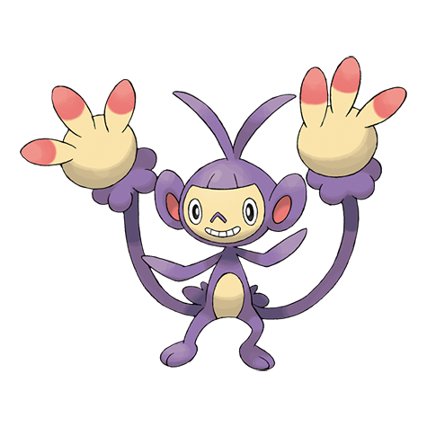

# Ambipom (#0424)

*Long Tail Pokemon*

**Type:** Normale
**Abilities:** [[Technician]], [[Pickup]], [[Skill Link]] *(Hidden)*
**Base HP:** 4

> They live in large colonies on the tallest trees, linking their tails to show friendship among herd mates. It loves fresh fruit. Ambipom uses its two tails better than its own arms to swing around.

---

## Statistiche (Attributes & Limits)

| Attribute | Base / Limit |
|---|---|
| **Strength** | 3/6 |
| **Dexterity** | 3/6 |
| **Vitality** | 2/4 |
| **Special** | 2/4 |
| **Insight** | 2/4 |

---

## Mosse (Learnset)

- **Starter:** [[Scratch|Scratch]], [[Tail_Whip|Tail Whip]]
- **Beginner:** [[Sand_Attack|Sand Attack]], [[Astonish|Astonish]], [[Dual_Chop|Dual Chop]], [[Baton_Pass|Baton Pass]]
- **Amateur:** [[Tickle|Tickle]], [[Fury_Swipes|Fury Swipes]], [[Swift|Swift]], [[Screech|Screech]], [[Agility|Agility]], [[Double_Hit|Double Hit]], [[Fling|Fling]]
- **Ace:** [[Nasty_Plot|Nasty Plot]], [[Last_Resort|Last Resort]]
- **Pro:** [[Fake_Out|Fake Out]], [[Seed_Bomb|Seed Bomb]], [[Ice_Punch|Ice Punch]]

---

