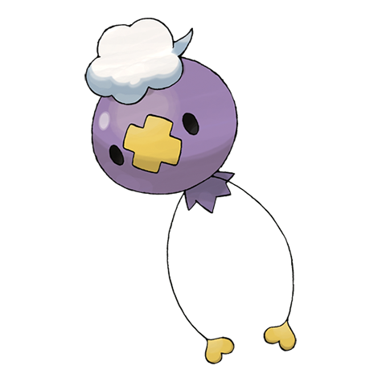

# Drifloon (#0425)

*Balloon Pokemon*

**Type:** Spettro / Volante
**Abilities:** [[Aftermath]], [[Unburden]], [[Flare Boost]] *(Hidden)*
**Base HP:** 3

> A Pokemon formed by the spirits of lost people and Pokemon. Children who mistake it for a real balloon often end up missing. Because it floats aimlessly, an old folktale calls it the “Signpost for Wandering Spirits.”

---

## Statistiche (Attributes & Limits)

| Attribute | Base / Limit |
|---|---|
| **Strength** | 2/4 |
| **Dexterity** | 2/5 |
| **Vitality** | 1/3 |
| **Special** | 2/4 |
| **Insight** | 2/4 |

---

## Mosse (Learnset)

- **Starter:** [[Constrict|Constrict]], [[Minimize|Minimize]]
- **Beginner:** [[Astonish|Astonish]], [[Gust|Gust]]
- **Amateur:** [[Focus_Energy|Focus Energy]], [[Payback|Payback]], [[Ominous_Wind|Ominous Wind]], [[Stockpile|Stockpile]], [[Hex|Hex]], [[Swallow|Swallow]], [[Spit_Up|Spit Up]]
- **Ace:** [[Shadow_Ball|Shadow Ball]], [[Amnesia|Amnesia]], [[Baton_Pass|Baton Pass]], [[Explosion|Explosion]]
- **Pro:** [[Disable|Disable]], [[Weather_Ball|Weather Ball]], [[Sucker_Punch|Sucker Punch]]

---

## Correlati

### Catena Evolutiva
- [[0425_Drifloon|Drifloon]]
- [[0426_Drifblim|Drifblim]]
