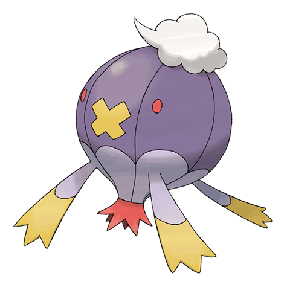

# Drifblim (#0426)

*Blimp Pokemon*

**Type:** Spettro / Volante
**Abilities:** [[Aftermath]], [[Unburden]], [[Flare Boost]] *(Hidden)*
**Base HP:** 7

> They float in groups in the evenings, sometimes carrying people or Pokemon. If you notice them, they suddenly vanish. No one knows where they go at night, and those who follow them never return.

---

## Statistiche (Attributes & Limits)

| Attribute | Base / Limit |
|---|---|
| **Strength** | 2/5 |
| **Dexterity** | 2/5 |
| **Vitality** | 1/3 |
| **Special** | 2/5 |
| **Insight** | 2/4 |

---

## Mosse (Learnset)

- **Starter:** [[Constrict|Constrict]], [[Minimize|Minimize]]
- **Beginner:** [[Astonish|Astonish]], [[Gust|Gust]]
- **Amateur:** [[Focus_Energy|Focus Energy]], [[Payback|Payback]], [[Ominous_Wind|Ominous Wind]], [[Stockpile|Stockpile]], [[Hex|Hex]], [[Swallow|Swallow]], [[Spit_Up|Spit Up]]
- **Ace:** [[Shadow_Ball|Shadow Ball]], [[Amnesia|Amnesia]], [[Baton_Pass|Baton Pass]], [[Explosion|Explosion]], [[Phantom_Force|Phantom Force]]
- **Pro:** [[Sucker_Punch|Sucker Punch]], [[Shock_Wave|Shock Wave]], [[Icy_Wind|Icy Wind]]

---

## Correlati

### Catena Evolutiva
- [[0425_Drifloon|Drifloon]]
- [[0426_Drifblim|Drifblim]]
