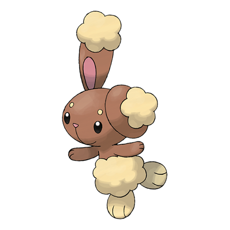

# Buneary (#0427)

*Rabbit Pokemon*

**Type:** Normale
**Abilities:** [[Run Away]], [[Klutz]], [[Limber]] *(Hidden)*
**Base HP:** 3

> Lives in forest, grasslands and even snowy mountains. It forms burrows and uses its soft fur to make nests and keep warm. You can see how it feels for the position of its ears. They are easily scared by humans.

---

## Statistiche (Attributes & Limits)

| Attribute | Base / Limit |
|---|---|
| **Strength** | 2/4 |
| **Dexterity** | 2/5 |
| **Vitality** | 1/3 |
| **Special** | 1/3 |
| **Insight** | 2/4 |

---

## Mosse (Learnset)

- **Starter:** [[Defense_Curl|Defense Curl]], [[Splash|Splash]], [[Pound|Pound]], [[Foresight|Foresight]]
- **Beginner:** [[Endure|Endure]], [[Baby_Doll_Eyes|Baby-Doll Eyes]]
- **Amateur:** [[Frustration|Frustration]], [[Quick_Attack|Quick Attack]], [[Jump_Kick|Jump Kick]], [[Baton_Pass|Baton Pass]], [[Agility|Agility]], [[Dizzy_Punch|Dizzy Punch]], [[Charm|Charm]]
- **Ace:** [[After_You|After You]], [[Entrainment|Entrainment]], [[Bounce|Bounce]], [[Healing_Wish|Healing Wish]]
- **Pro:** [[Cosmic_Power|Cosmic Power]], [[Fake_Out|Fake Out]], [[Sweet_Kiss|Sweet Kiss]]

---

## Correlati

### Catena Evolutiva
- [[0427_Buneary|Buneary]]
- [[0428_Lopunny|Lopunny]]
- Lopunny (Mega Form)
