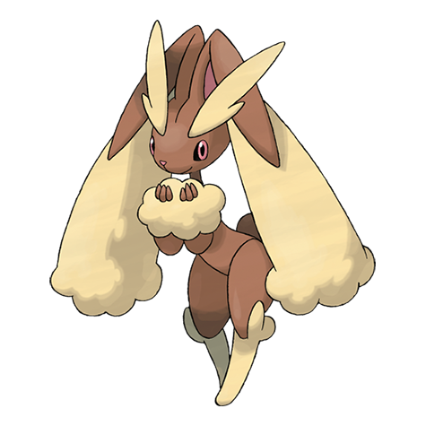

# Lopunny (#0428)

*Rabbit Pokemon*

**Type:** Normale
**Abilities:** [[Cute Charm]], [[Klutz]], [[Limber]] *(Hidden)*
**Base HP:** 4

> Lopunny is extremely cautious, it quickly bounds off when it senses danger. If they are touched roughly, they throw kicks and jump away. Keep the fur it sheds as it’s highly valued to make quality yarn.

---

## Statistiche (Attributes & Limits)

| Attribute | Base / Limit |
|---|---|
| **Strength** | 2/5 |
| **Dexterity** | 3/6 |
| **Vitality** | 2/5 |
| **Special** | 2/4 |
| **Insight** | 3/6 |

---

## Mosse (Learnset)

- **Starter:** [[Defense_Curl|Defense Curl]], [[Splash|Splash]], [[Pound|Pound]], [[Foresight|Foresight]]
- **Beginner:** [[Endure|Endure]]
- **Amateur:** [[Return|Return]], [[Bounce|Bounce]], [[Rototiller|Rototiller]], [[Mirror_Coat|Mirror Coat]], [[Magic_Coat|Magic Coat]], [[Quick_Attack|Quick Attack]], [[Jump_Kick|Jump Kick]], [[Baton_Pass|Baton Pass]], [[Agility|Agility]], [[Dizzy_Punch|Dizzy Punch]], [[After_You|After You]], [[Charm|Charm]]
- **Ace:** [[Entrainment|Entrainment]], [[Healing_Wish|Healing Wish]], [[High_Jump_Kick|High Jump Kick]]
- **Pro:** [[Cosmic_Power|Cosmic Power]], [[Teeter_Dance|Teeter Dance]], [[Fake_Out|Fake Out]]

---

## Correlati

### Catena Evolutiva
- [[0427_Buneary|Buneary]]
- [[0428_Lopunny|Lopunny]]
- Lopunny (Mega Form)

---

## Mega Lopunny (#0428M1)

**Type:** Normale / Lotta
**Abilities:** [[Scrappy]]
**Base HP:** 5

| Attribute | Base / Limit |
|---|---|
| **Strength** | 3/7 |
| **Dexterity** | 3/7 |
| **Vitality** | 3/6 |
| **Special** | 2/4 |
| **Insight** | 3/6 |

### Mosse

- **Starter:** [[Defense_Curl|Defense Curl]], [[Splash|Splash]], [[Pound|Pound]], [[Foresight|Foresight]]
- **Beginner:** [[Endure|Endure]]
- **Amateur:** [[Return|Return]], [[Bounce|Bounce]], [[Rototiller|Rototiller]], [[Mirror_Coat|Mirror Coat]], [[Magic_Coat|Magic Coat]], [[Quick_Attack|Quick Attack]], [[Jump_Kick|Jump Kick]], [[Baton_Pass|Baton Pass]], [[Agility|Agility]], [[Dizzy_Punch|Dizzy Punch]], [[After_You|After You]], [[Charm|Charm]]
- **Ace:** [[Entrainment|Entrainment]], [[Healing_Wish|Healing Wish]], [[High_Jump_Kick|High Jump Kick]]
- **Pro:** [[Cosmic_Power|Cosmic Power]], [[Teeter_Dance|Teeter Dance]], [[Fake_Out|Fake Out]]
