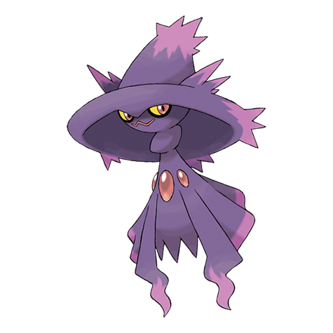

# Mismagius (#0429)

*Magical Pokemon*

**Type:** Spettro
**Abilities:** [[Levitate]]
**Base HP:** 4

> Extremely rare. Their cries sound like incantations, hearing them gives you bad headaches and hallucinations. It is said that some Mismagius are benevolent and have granted good fortune to people they like.

---

## Statistiche (Attributes & Limits)

| Attribute | Base / Limit |
|---|---|
| **Strength** | 2/4 |
| **Dexterity** | 3/6 |
| **Vitality** | 2/4 |
| **Special** | 3/6 |
| **Insight** | 3/6 |

---

## Mosse (Learnset)

- **Starter:** [[Growl|Growl]]
- **Beginner:** [[Magical_Leaf|Magical Leaf]], [[Lucky_Chant|Lucky Chant]]
- **Amateur:** [[Astonish|Astonish]], [[Power_Gem|Power Gem]], [[Psywave|Psywave]], [[Spite|Spite]]
- **Ace:** [[Phantom_Force|Phantom Force]], [[Mystical_Fire|Mystical Fire]]
- **Pro:** [[Wonder_Room|Wonder Room]], [[Foul_Play|Foul Play]], [[Nasty_Plot|Nasty Plot]]

---

