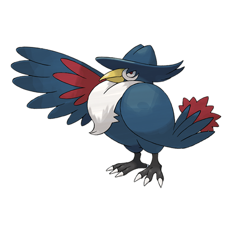

# Honchkrow (#0430)

*Big Boss Pokemon*

**Type:** Buio / Volante
**Abilities:** [[Insomnia]], [[Super Luck]], [[Moxie]] *(Hidden)*
**Base HP:** 5

> It lets out a deep cry to summon Murkrows, which fetch food and shiny objects to Honchkrow. It is, however, a tyrant to the Murkrow. It only goes out at night to carry out evil deeds.

---

## Statistiche (Attributes & Limits)

| Attribute | Base / Limit |
|---|---|
| **Strength** | 3/7 |
| **Dexterity** | 2/5 |
| **Vitality** | 2/4 |
| **Special** | 3/6 |
| **Insight** | 2/4 |

---

## Mosse (Learnset)

- **Starter:** [[Astonish|Astonish]]
- **Beginner:** [[Wing_Attack|Wing Attack]], [[Pursuit|Pursuit]], [[Haze|Haze]]
- **Amateur:** [[Dark_Pulse|Dark Pulse]], [[Night_Slash|Night Slash]], [[Swagger|Swagger]], [[Nasty_Plot|Nasty Plot]], [[Foul_Play|Foul Play]]
- **Ace:** [[Quash|Quash]], [[Sucker_Punch|Sucker Punch]]
- **Pro:** [[Perish_Song|Perish Song]], [[Heat_Wave|Heat Wave]], [[Air_Cutter|Air Cutter]]

---

