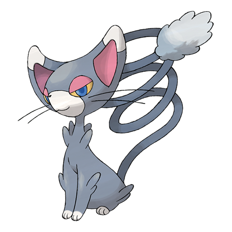

# Glameow (#0431)

*Catty Pokemon*

**Type:** Normale
**Abilities:** [[Limber]], [[Own Tempo]], [[Keen Eye]] *(Hidden)*
**Base HP:** 3

> It is plentiful in urban areas, as it is a popular pet. It has a very fickle nature, purring in happiness one second, then hooking its claws into its trainer’s nose. It loves to be admired and pampered.

---

## Statistiche (Attributes & Limits)

| Attribute | Base / Limit |
|---|---|
| **Strength** | 2/4 |
| **Dexterity** | 2/5 |
| **Vitality** | 1/3 |
| **Special** | 1/3 |
| **Insight** | 1/3 |

---

## Mosse (Learnset)

- **Starter:** [[Fake_Out|Fake Out]]
- **Beginner:** [[Scratch|Scratch]], [[Growl|Growl]]
- **Amateur:** [[Hypnosis|Hypnosis]], [[Feint_Attack|Feint Attack]], [[Fury_Swipes|Fury Swipes]], [[Charm|Charm]]
- **Ace:** [[Assist|Assist]], [[Captivate|Captivate]], [[Slash|Slash]]
- **Pro:** [[Attract|Attract]], [[Sucker_Punch|Sucker Punch]], [[Hone_Claws|Hone Claws]]

---

## Correlati

### Catena Evolutiva
- [[0431_Glameow|Glameow]]
- [[0432_Purugly|Purugly]]
