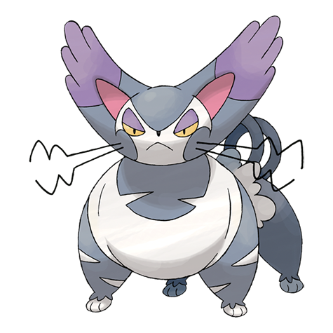

# Purugly (#0432)

*Tiger Cat Pokemon*

**Type:** Normale
**Abilities:** [[Thick Fat]], [[Own Tempo]], [[Defiant]] *(Hidden)*
**Base HP:** 4

> It becomes wilder and aggressive after evolving. It is known to claim other Pokemon nests as its own. It will make itself appear bigger and glare with piercing eyes to achieve dominance over someone.

---

## Statistiche (Attributes & Limits)

| Attribute | Base / Limit |
|---|---|
| **Strength** | 2/5 |
| **Dexterity** | 3/6 |
| **Vitality** | 2/4 |
| **Special** | 2/4 |
| **Insight** | 2/4 |

---

## Mosse (Learnset)

- **Starter:** [[Fake_Out|Fake Out]]
- **Beginner:** [[Scratch|Scratch]], [[Growl|Growl]]
- **Amateur:** [[Hypnosis|Hypnosis]], [[Feint_Attack|Feint Attack]], [[Fury_Swipes|Fury Swipes]], [[Charm|Charm]], [[Assist|Assist]], [[Captivate|Captivate]], [[Slash|Slash]], [[Swagger|Swagger]]
- **Ace:** [[Body_Slam|Body Slam]], [[Attract|Attract]], [[Hone_Claws|Hone Claws]]
- **Pro:** [[Last_Resort|Last Resort]], [[Hyper_Voice|Hyper Voice]], [[Wake_Up_Slap|Wake-Up Slap]]

---

## Correlati

### Catena Evolutiva
- [[0431_Glameow|Glameow]]
- [[0432_Purugly|Purugly]]
