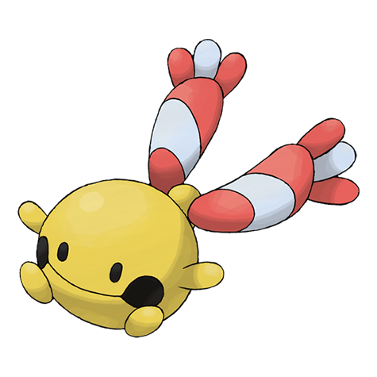

# Chingling (#0433)

*Bell Pokemon*

**Type:** Psico
**Abilities:** [[Levitate]]
**Base HP:** 3

> It has a ball inside its mouth that makes a ringing sound when it hops around. To defend itself, it will emit low frequency cries that deafen its foes. However this sound is not audible to humans.

---

## Statistiche (Attributes & Limits)

| Attribute | Base / Limit |
|---|---|
| **Strength** | 1/3 |
| **Dexterity** | 2/4 |
| **Vitality** | 2/4 |
| **Special** | 2/4 |
| **Insight** | 2/4 |

---

## Mosse (Learnset)

- **Starter:** [[Wrap|Wrap]]
- **Beginner:** [[Growl|Growl]], [[Astonish|Astonish]]
- **Amateur:** [[Yawn|Yawn]], [[Confusion|Confusion]], [[Uproar|Uproar]]
- **Ace:** [[Last_Resort|Last Resort]], [[Entrainment|Entrainment]]
- **Pro:** [[Cosmic_Power|Cosmic Power]], [[Recover|Recover]], [[Future_Sight|Future Sight]]

---

## Correlati

### Catena Evolutiva
- [[0433_Chingling|Chingling]]
- [[0358_Chimecho|Chimecho]]
