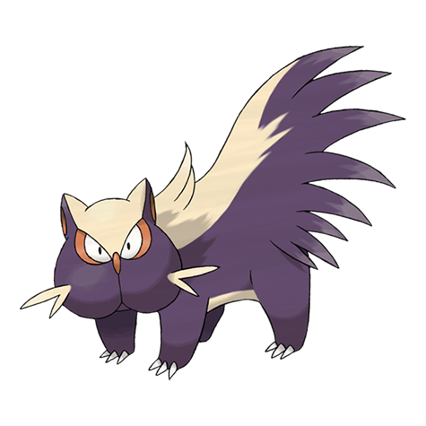

# Stunky (#0434)

*Skunk Pokemon*

**Type:** Veleno / Buio
**Abilities:** [[Stench]], [[Aftermath]], [[Keen Eye]] *(Hidden)*
**Base HP:** 3

> Over the years they have moved closer to towns and other human settlements. They release a foul liquid from their rear that stinks for days to scare away predators. But sometimes they do it just for fun.

---

## Statistiche (Attributes & Limits)

| Attribute | Base / Limit |
|---|---|
| **Strength** | 2/4 |
| **Dexterity** | 2/4 |
| **Vitality** | 2/4 |
| **Special** | 1/3 |
| **Insight** | 1/3 |

---

## Mosse (Learnset)

- **Starter:** [[Scratch|Scratch]], [[Focus_Energy|Focus Energy]]
- **Beginner:** [[Poison_Gas|Poison Gas]], [[Screech|Screech]], [[Fury_Swipes|Fury Swipes]]
- **Amateur:** [[Smokescreen|Smokescreen]], [[Feint|Feint]], [[Bite|Bite]], [[Slash|Slash]], [[Toxic|Toxic]], [[Acid_Spray|Acid Spray]], [[Venom_Drench|Venom Drench]]
- **Ace:** [[Night_Slash|Night Slash]], [[Memento|Memento]], [[Belch|Belch]], [[Explosion|Explosion]]
- **Pro:** [[Play_Rough|Play Rough]], [[Sucker_Punch|Sucker Punch]], [[Flame_Burst|Flame Burst]]

---

## Correlati

### Catena Evolutiva
- [[0434_Stunky|Stunky]]
- [[0435_Skuntank|Skuntank]]
