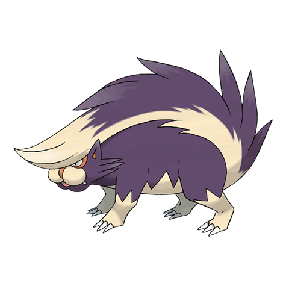

# Skuntank (#0435)

*Skunk Pokemon*

**Type:** Veleno / Buio
**Abilities:** [[Stench]], [[Aftermath]], [[Keen Eye]] *(Hidden)*
**Base HP:** 5

> It sprays a reeking fluid from its tail. The fluid smells worse the longer it is allowed to fester. It is vulnerable to attacks that come from above due to its exuberant tail. When it’s relaxed it doesn’t smell bad.

---

## Statistiche (Attributes & Limits)

| Attribute | Base / Limit |
|---|---|
| **Strength** | 2/5 |
| **Dexterity** | 2/5 |
| **Vitality** | 2/4 |
| **Special** | 2/5 |
| **Insight** | 2/4 |

---

## Mosse (Learnset)

- **Starter:** [[Scratch|Scratch]], [[Focus_Energy|Focus Energy]]
- **Beginner:** [[Poison_Gas|Poison Gas]], [[Screech|Screech]], [[Fury_Swipes|Fury Swipes]]
- **Amateur:** [[Smokescreen|Smokescreen]], [[Feint|Feint]], [[Bite|Bite]], [[Slash|Slash]], [[Toxic|Toxic]], [[Acid_Spray|Acid Spray]], [[Flamethrower|Flamethrower]], [[Venom_Drench|Venom Drench]]
- **Ace:** [[Night_Slash|Night Slash]], [[Memento|Memento]], [[Belch|Belch]], [[Explosion|Explosion]]
- **Pro:** [[Play_Rough|Play Rough]], [[Sucker_Punch|Sucker Punch]], [[Scary_Face|Scary Face]]

---

## Correlati

### Catena Evolutiva
- [[0434_Stunky|Stunky]]
- [[0435_Skuntank|Skuntank]]
