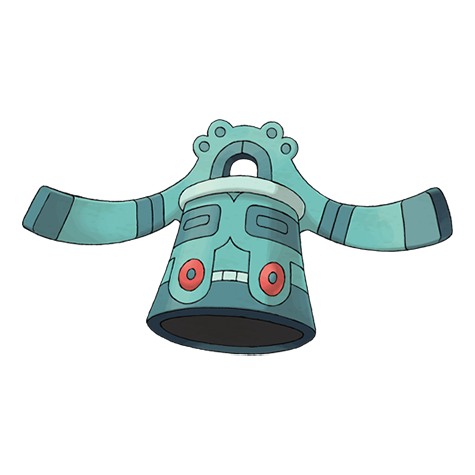

# Bronzong (#0437)

*Bronze Bell Pokemon*

**Type:** Acciaio / Psico
**Abilities:** [[Levitate]], [[Heatproof]], [[Heavy Metal]] *(Hidden)*
**Base HP:** 4

> Ancient people revered Bronzong for bringing the rain and sun at will. One became a news sensation recently when it was dug up at a construction site after a 2000-year sleep.

---

## Statistiche (Attributes & Limits)

| Attribute | Base / Limit |
|---|---|
| **Strength** | 2/5 |
| **Dexterity** | 1/3 |
| **Vitality** | 3/6 |
| **Special** | 2/5 |
| **Insight** | 3/6 |

---

## Mosse (Learnset)

- **Starter:** [[Sunny_Day|Sunny Day]], [[Rain_Dance|Rain Dance]], [[Tackle|Tackle]], [[Confusion|Confusion]]
- **Beginner:** [[Hypnosis|Hypnosis]], [[Imprison|Imprison]], [[Confuse_Ray|Confuse Ray]]
- **Amateur:** [[Psywave|Psywave]], [[Iron_Defense|Iron Defense]], [[Feint_Attack|Feint Attack]], [[Safeguard|Safeguard]], [[Future_Sight|Future Sight]], [[Metal_Sound|Metal Sound]], [[Block|Block]], [[Gyro_Ball|Gyro Ball]]
- **Ace:** [[Extrasensory|Extrasensory]], [[Payback|Payback]], [[Heal_Block|Heal Block]], [[Heavy_Slam|Heavy Slam]]
- **Pro:** [[Ancient_Power|Ancient Power]], [[Iron_Head|Iron Head]], [[Skill_Swap|Skill Swap]]

---

## Correlati

### Catena Evolutiva
- [[0436_Bronzor|Bronzor]]
- [[0437_Bronzong|Bronzong]]
