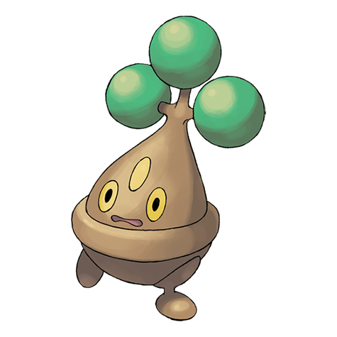

# Bonsly (#0438)

*Bonsai Pokemon*

**Type:** Roccia
**Abilities:** [[Sturdy]], [[Rock Head]], [[Rattled]] *(Hidden)*
**Base HP:** 3

> They thrive in arid places. It looks like it’s crying all the time but it’s actually adjusting the moisture of its body and releasing excess water. Over time they become excellent at impersonating trees.

---

## Statistiche (Attributes & Limits)

| Attribute | Base / Limit |
|---|---|
| **Strength** | 2/5 |
| **Dexterity** | 1/2 |
| **Vitality** | 3/6 |
| **Special** | 1/2 |
| **Insight** | 2/4 |

---

## Mosse (Learnset)

- **Starter:** [[Fake_Tears|Fake Tears]], [[Copycat|Copycat]]
- **Beginner:** [[Flail|Flail]], [[Low_Kick|Low Kick]]
- **Amateur:** [[Rock_Throw|Rock Throw]], [[Mimic|Mimic]], [[Feint_Attack|Feint Attack]], [[Rock_Tomb|Rock Tomb]], [[Tearful_Look|Tearful Look]], [[Block|Block]]
- **Ace:** [[Rock_Slide|Rock Slide]], [[Counter|Counter]], [[Sucker_Punch|Sucker Punch]], [[Double_Edge|Double-Edge]]
- **Pro:** [[Sand_Tomb|Sand Tomb]], [[Rest|Rest]], [[Foul_Play|Foul Play]]

---

## Correlati

### Catena Evolutiva
- [[0438_Bonsly|Bonsly]]
- [[0185_Sudowoodo|Sudowoodo]]
