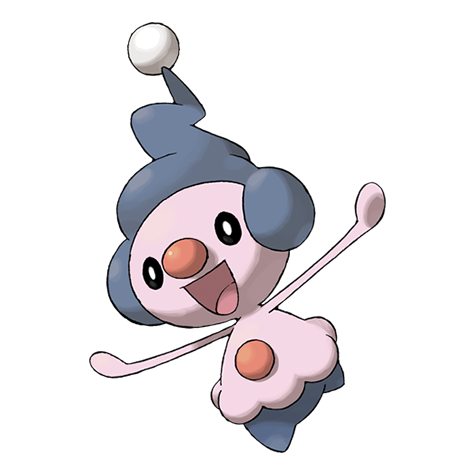

# Mime Jr. (#0439)

*Mime Pokemon*

**Type:** Psico / Folletto
**Abilities:** [[Soundproof]], [[Filter]], [[Technician]] *(Hidden)*
**Base HP:** 3

> It likes places where people gather and imitates their expressions to try to understand their feelings. It mimics foes, confuses them, then it escapes. It doesn’t take long to become a master mime.

---

## Statistiche (Attributes & Limits)

| Attribute | Base / Limit |
|---|---|
| **Strength** | 1/3 |
| **Dexterity** | 2/4 |
| **Vitality** | 2/4 |
| **Special** | 2/5 |
| **Insight** | 2/5 |

---

## Mosse (Learnset)

- **Starter:** [[Tickle|Tickle]], [[Barrier|Barrier]], [[Confusion|Confusion]]
- **Beginner:** [[Copycat|Copycat]], [[Meditate|Meditate]], [[Double_Slap|Double Slap]]
- **Amateur:** [[Mimic|Mimic]], [[Encore|Encore]], [[Light_Screen|Light Screen]], [[Reflect|Reflect]], [[Psybeam|Psybeam]], [[Substitute|Substitute]], [[Trick|Trick]]
- **Ace:** [[Recycle|Recycle]], [[Psychic|Psychic]], [[Role_Play|Role Play]], [[Baton_Pass|Baton Pass]], [[Safeguard|Safeguard]]
- **Pro:** [[Teeter_Dance|Teeter Dance]], [[Nasty_Plot|Nasty Plot]], [[Wake_Up_Slap|Wake-Up Slap]]

---
