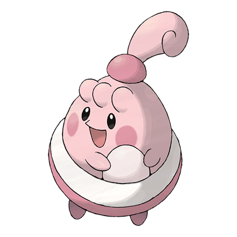

# Happiny (#0440)

*Playhouse Pokemon*

**Type:** Normale
**Abilities:** [[Natural Cure]], [[Serene Grace]], [[Friend Guard]] *(Hidden)*
**Base HP:** 4

> It is not common to see Happinies. This baby Pokemon cannot produce eggs yet, so she searches for white stones and carries them on its pouch. It likes to look pretty and tries to always be adorable.

---

## Statistiche (Attributes & Limits)

| Attribute | Base / Limit |
|---|---|
| **Strength** | 1/2 |
| **Dexterity** | 1/3 |
| **Vitality** | 1/2 |
| **Special** | 1/2 |
| **Insight** | 1/3 |

---

## Mosse (Learnset)

- **Starter:** [[Pound|Pound]], [[Charm|Charm]]
- **Beginner:** [[Copycat|Copycat]], [[Refresh|Refresh]]
- **Amateur:** [[Sweet_Kiss|Sweet Kiss]]
- **Pro:** [[Helping_Hand|Helping Hand]], [[Present|Present]], [[Drain_Punch|Drain Punch]]

---

## Correlati

### Catena Evolutiva
- [[0440_Happiny|Happiny]]
- [[0113_Chansey|Chansey]]
