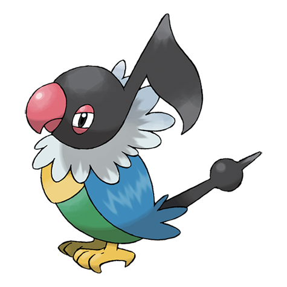

# Chatot (#0441)

*Music Note Pokemon*

**Type:** Normale / Volante
**Abilities:** [[Keen Eye]], [[Tangled Feet]], [[Big Pecks]] *(Hidden)*
**Base HP:** 4

> It mimics the cries of other Pokemon to trick them into thinking it’s one of them, this way they won’t attack it. Chatots that live with humans learn words and phrases but it’s unknown it they really know their meaning.

---

## Statistiche (Attributes & Limits)

| Attribute | Base / Limit |
|---|---|
| **Strength** | 2/4 |
| **Dexterity** | 2/5 |
| **Vitality** | 2/4 |
| **Special** | 2/5 |
| **Insight** | 2/4 |

---

## Mosse (Learnset)

- **Starter:** [[Confide|Confide]], [[Taunt|Taunt]], [[Peck|Peck]]
- **Beginner:** [[Growl|Growl]], [[Mirror_Move|Mirror Move]]
- **Amateur:** [[Chatter|Chatter]], [[Hyper_Voice|Hyper Voice]], [[Sing|Sing]], [[Fury_Attack|Fury Attack]], [[Round|Round]], [[Mimic|Mimic]], [[Echoed_Voice|Echoed Voice]]
- **Ace:** [[Roost|Roost]], [[Uproar|Uproar]], [[Synchronoise|Synchronoise]], [[Feather_Dance|Feather Dance]]
- **Pro:** [[Agility|Agility]], [[Boomburst|Boomburst]], [[Nasty_Plot|Nasty Plot]]

---

