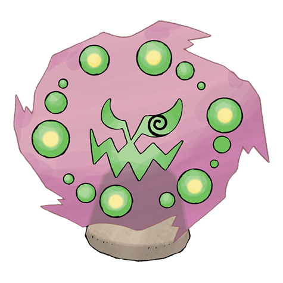

# Spiritomb (#0442)

*Forbidden Pokemon*

**Type:** Spettro / Buio
**Abilities:** [[Pressure]], [[Infiltrator]] *(Hidden)*
**Base HP:** 4

> A legend from 500 years ago tells how it got bound into an Odd Keystone after cursing an entire town. Two have been found in recent times. It is said that its vortex has more than 100 haunted souls.

---

## Statistiche (Attributes & Limits)

| Attribute | Base / Limit |
|---|---|
| **Strength** | 2/5 |
| **Dexterity** | 1/3 |
| **Vitality** | 3/6 |
| **Special** | 2/5 |
| **Insight** | 3/6 |

---

## Mosse (Learnset)

- **Starter:** [[Curse|Curse]], [[Pursuit|Pursuit]], [[Confuse_Ray|Confuse Ray]], [[Spite|Spite]]
- **Beginner:** [[Shadow_Sneak|Shadow Sneak]], [[Feint_Attack|Feint Attack]]
- **Amateur:** [[Hypnosis|Hypnosis]], [[Dream_Eater|Dream Eater]], [[Ominous_Wind|Ominous Wind]], [[Sucker_Punch|Sucker Punch]], [[Nasty_Plot|Nasty Plot]], [[Dark_Pulse|Dark Pulse]]
- **Ace:** [[Memento|Memento]]
- **Pro:** [[Destiny_Bond|Destiny Bond]], [[Telekinesis|Telekinesis]], [[Imprison|Imprison]]

---

