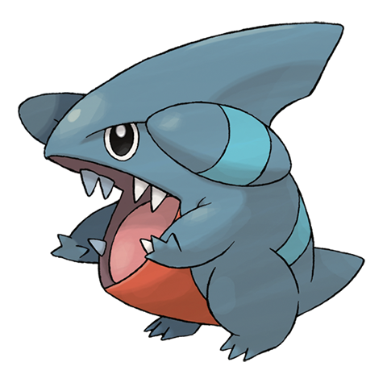

# Gible (#0443)

*Land Shark Pokemon*

**Type:** Drago / Terra
**Abilities:** [[Sand Veil]], [[Rough Skin]] *(Hidden)*
**Base HP:** 3

> It digs tunnels and follows prey while burrowed underground. If you see the fin on its back coming out the ground it means it is about to attack. It’s very aggressive but kind of clumsy. Beware of its big jaws.

---

## Statistiche (Attributes & Limits)

| Attribute | Base / Limit |
|---|---|
| **Strength** | 2/5 |
| **Dexterity** | 1/3 |
| **Vitality** | 2/4 |
| **Special** | 1/3 |
| **Insight** | 2/4 |

---

## Mosse (Learnset)

- **Starter:** [[Tackle|Tackle]]
- **Beginner:** [[Sand_Attack|Sand Attack]], [[Dragon_Rage|Dragon Rage]]
- **Amateur:** [[Sandstorm|Sandstorm]], [[Take_Down|Take Down]], [[Sand_Tomb|Sand Tomb]], [[Slash|Slash]], [[Dragon_Claw|Dragon Claw]], [[Dig|Dig]]
- **Ace:** [[Dragon_Rush|Dragon Rush]]
- **Pro:** [[Scary_Face|Scary Face]], [[Draco_Meteor|Draco Meteor]], [[Iron_Head|Iron Head]]

---

## Correlati

### Catena Evolutiva
- [[0443_Gible|Gible]]
- [[0444_Gabite|Gabite]]
- [[0445_Garchomp|Garchomp]]
- Garchomp (Mega Form)
