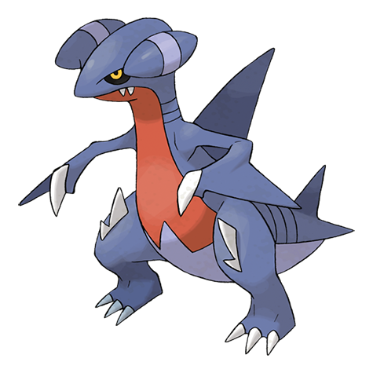

# Gabite (#0444)

*Cave Pokemon*

**Type:** Drago / Terra
**Abilities:** [[Sand Veil]], [[Rough Skin]] *(Hidden)*
**Base HP:** 4

> It hoards a small treasure of sparkly things back in its cave. It will react aggressively towards any potential thief. It is also an excellent hunter, capable of running, swimming and gliding extremely fast.

---

## Statistiche (Attributes & Limits)

| Attribute | Base / Limit |
|---|---|
| **Strength** | 2/5 |
| **Dexterity** | 2/5 |
| **Vitality** | 2/4 |
| **Special** | 2/4 |
| **Insight** | 2/4 |

---

## Mosse (Learnset)

- **Beginner:** [[Tackle|Tackle]], [[Sand_Attack|Sand Attack]]
- **Amateur:** [[Dragon_Rage|Dragon Rage]], [[Sandstorm|Sandstorm]], [[Take_Down|Take Down]], [[Sand_Tomb|Sand Tomb]], [[Dual_Chop|Dual Chop]], [[Slash|Slash]], [[Dragon_Claw|Dragon Claw]]
- **Ace:** [[Dig|Dig]], [[Dragon_Rush|Dragon Rush]]
- **Pro:** [[Scary_Face|Scary Face]], [[Metal_Claw|Metal Claw]], [[Draco_Meteor|Draco Meteor]]

---

## Correlati

### Catena Evolutiva
- [[0443_Gible|Gible]]
- [[0444_Gabite|Gabite]]
- [[0445_Garchomp|Garchomp]]
- Garchomp (Mega Form)
