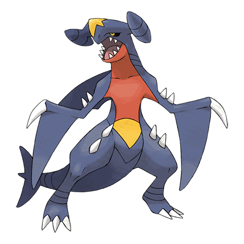

# Garchomp (#0445)

*Mach Pokemon*

**Type:** Drago / Terra
**Abilities:** [[Sand Veil]], [[Rough Skin]] *(Hidden)*
**Base HP:** 6

> Garchomps are scarce in the wild and very dangerous. It folds its arms and uses its fins to fly extremely fast at low heights. Territorial and aggressive it will not rest until it catches any daring trespasser.

---

## Statistiche (Attributes & Limits)

| Attribute | Base / Limit |
|---|---|
| **Strength** | 3/7 |
| **Dexterity** | 3/6 |
| **Vitality** | 3/6 |
| **Special** | 2/5 |
| **Insight** | 2/5 |

---

## Mosse (Learnset)

- **Starter:** [[Tackle|Tackle]]
- **Beginner:** [[Dragon_Rage|Dragon Rage]], [[Sand_Attack|Sand Attack]]
- **Amateur:** [[Sandstorm|Sandstorm]], [[Fire_Fang|Fire Fang]], [[Take_Down|Take Down]], [[Sand_Tomb|Sand Tomb]], [[Dual_Chop|Dual Chop]], [[Slash|Slash]], [[Dragon_Claw|Dragon Claw]], [[Dig|Dig]], [[Crunch|Crunch]]
- **Ace:** [[Dragon_Rush|Dragon Rush]]
- **Pro:** [[Draco_Meteor|Draco Meteor]], [[Aqua_Tail|Aqua Tail]], [[Outrage|Outrage]]

---

## Correlati

### Catena Evolutiva
- [[0443_Gible|Gible]]
- [[0444_Gabite|Gabite]]
- [[0445_Garchomp|Garchomp]]
- Garchomp (Mega Form)
