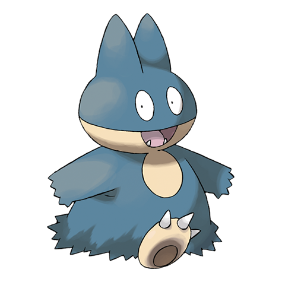

# Munchlax (#0446)

*Big Eater Pokemon*

**Type:** Normale
**Abilities:** [[Pickup]], [[Thick Fat]], [[Gluttony]] *(Hidden)*
**Base HP:** 5

> A Munchlaxes appetite is never really satisfied, it can eat its weight in food and will almost never care about what it is eating. They tend to pick up anything that looks edible and save it for later.

---

## Statistiche (Attributes & Limits)

| Attribute | Base / Limit |
|---|---|
| **Strength** | 2/5 |
| **Dexterity** | 1/2 |
| **Vitality** | 1/3 |
| **Special** | 1/3 |
| **Insight** | 2/5 |

---

## Mosse (Learnset)

- **Starter:** [[Snatch|Snatch]], [[Lick|Lick]], [[Tackle|Tackle]], [[Odor_Sleuth|Odor Sleuth]]
- **Beginner:** [[Metronome|Metronome]], [[Defense_Curl|Defense Curl]], [[Amnesia|Amnesia]]
- **Amateur:** [[Chip_Away|Chip Away]], [[Screech|Screech]], [[Body_Slam|Body Slam]], [[Stockpile|Stockpile]], [[Swallow|Swallow]], [[Rollout|Rollout]], [[Fling|Fling]]
- **Ace:** [[Belly_Drum|Belly Drum]], [[Natural_Gift|Natural Gift]], [[Last_Resort|Last Resort]]
- **Pro:** [[Charm|Charm]], [[Belch|Belch]], [[Zen_Headbutt|Zen Headbutt]]

---

## Correlati

### Catena Evolutiva
- [[0446_Munchlax|Munchlax]]
- [[0143_Snorlax|Snorlax]]
