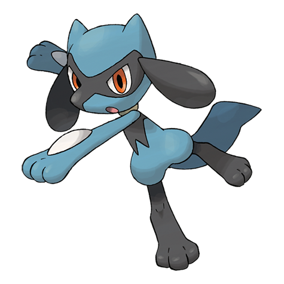

# Riolu (#0447)

*Emanation Pokemon*

**Type:** Lotta
**Abilities:** [[Steadfast]], [[Inner Focus]], [[Prankster]] *(Hidden)*
**Base HP:** 3

> Scarce in the wild but they have been seen in the mountains. It has the ability to see the auras of others, through this power it is capable of sensing emotions. It won’t get close to those with selfish intentions.

---

## Statistiche (Attributes & Limits)

| Attribute | Base / Limit |
|---|---|
| **Strength** | 2/5 |
| **Dexterity** | 2/4 |
| **Vitality** | 1/3 |
| **Special** | 1/3 |
| **Insight** | 1/3 |

---

## Mosse (Learnset)

- **Starter:** [[Foresight|Foresight]], [[Quick_Attack|Quick Attack]], [[Endure|Endure]]
- **Beginner:** [[Counter|Counter]], [[Feint|Feint]]
- **Amateur:** [[Force_Palm|Force Palm]], [[Copycat|Copycat]], [[Screech|Screech]], [[Reversal|Reversal]]
- **Ace:** [[Nasty_Plot|Nasty Plot]], [[Final_Gambit|Final Gambit]]
- **Pro:** [[Blaze_Kick|Blaze Kick]], [[Agility|Agility]], [[Aura_Sphere|Aura Sphere]]

---

## Correlati

### Catena Evolutiva
- [[0447_Riolu|Riolu]]
- [[0448_Lucario|Lucario]]
- Lucario (Mega Form)
