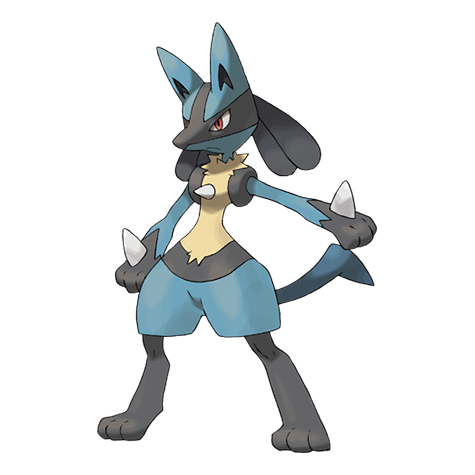

# Lucario (#0448)

*Aura Pokemon*

**Type:** Lotta / Acciaio
**Abilities:** [[Steadfast]], [[Inner Focus]], [[Justified]] *(Hidden)*
**Base HP:** 4

> This Pokemon is completely loyal to its trainer. It has the ability to not only see the auras but also to transform them into energy. It is also capable of understanding human speech.

---

## Statistiche (Attributes & Limits)

| Attribute | Base / Limit |
|---|---|
| **Strength** | 3/6 |
| **Dexterity** | 2/5 |
| **Vitality** | 2/5 |
| **Special** | 3/6 |
| **Insight** | 2/5 |

---

## Mosse (Learnset)

- **Starter:** [[Laser_Focus|Laser Focus]], [[Quick_Attack|Quick Attack]], [[Foresight|Foresight]]
- **Beginner:** [[Metal_Claw|Metal Claw]], [[Detect|Detect]], [[Feint|Feint]], [[Counter|Counter]]
- **Amateur:** [[Swords_Dance|Swords Dance]], [[Power_Up_Punch|Power-Up Punch]], [[Bone_Rush|Bone Rush]], [[Metal_Sound|Metal Sound]], [[Me_First|Me First]], [[Quick_Guard|Quick Guard]], [[Work_Up|Work Up]], [[Aura_Sphere|Aura Sphere]], [[Calm_Mind|Calm Mind]]
- **Ace:** [[Heal_Pulse|Heal Pulse]], [[Close_Combat|Close Combat]], [[Dragon_Pulse|Dragon Pulse]]
- **Pro:** [[Extreme_Speed|Extreme Speed]], [[Iron_Defense|Iron Defense]], [[Vacuum_Wave|Vacuum Wave]]

---

## Correlati

### Catena Evolutiva
- [[0447_Riolu|Riolu]]
- [[0448_Lucario|Lucario]]
- Lucario (Mega Form)
